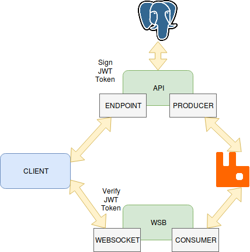

# Web Pub/Sub Architecture
Example with simple chat

## ARCHI:
---


## Start project:
---

* Start containers:
```
> $ docker-compose up
```
* Create database and setup API:
```
> $ docker exec -it chatexample_php_1 sh
> $ bin/console doctrine:schema:create
> $ bin/console app:setup
```
* Setup RabbitMq:
```
> $ docker exec -it chatexample_rabbitmq_1 sh
> $ sh /etc/rabbitmq/setup.sh
```

* Restart containers:
```
> $ docker-compose up
```

## Run CLI Client:
---

* Get dependencies:
```
> $ cd client
> $ go get .
```

* Start Chat with user test1:
```
> $ go run main.go auth test1 test1 --api=symfony.dev --ws=localhost:4000
yo <enter>
```

* Start Chat with user test2:
```
> $ go run main.go auth test1 test1 --api=symfony.dev --ws=localhost:4000
<new message>
```
